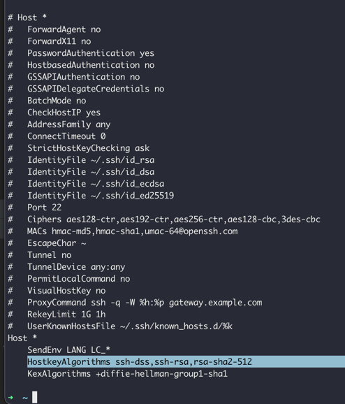

Mac 에서 ssh 접속시도시 발생하는 오류

```bash
➜  ~ ssh min@somehost
Unable to negotiate with xxx.xxx.xxx.xx port 22: no matching host key type found. Their offer: rsa-sha2-512,rsa-sha2-256,ecdsa-sha2-nistp256,ssh-ed25519
```

아래와 같이 ssh 관련 설정 파일을 열고
```
sudo vi /etc/ssh/ssh_config
```

HostkeyAlgorithms 항목에 필요한 알고리즘을 추가한다.



<br/>
<br/>

## Ref
- https://jsikim1.tistory.com/336
