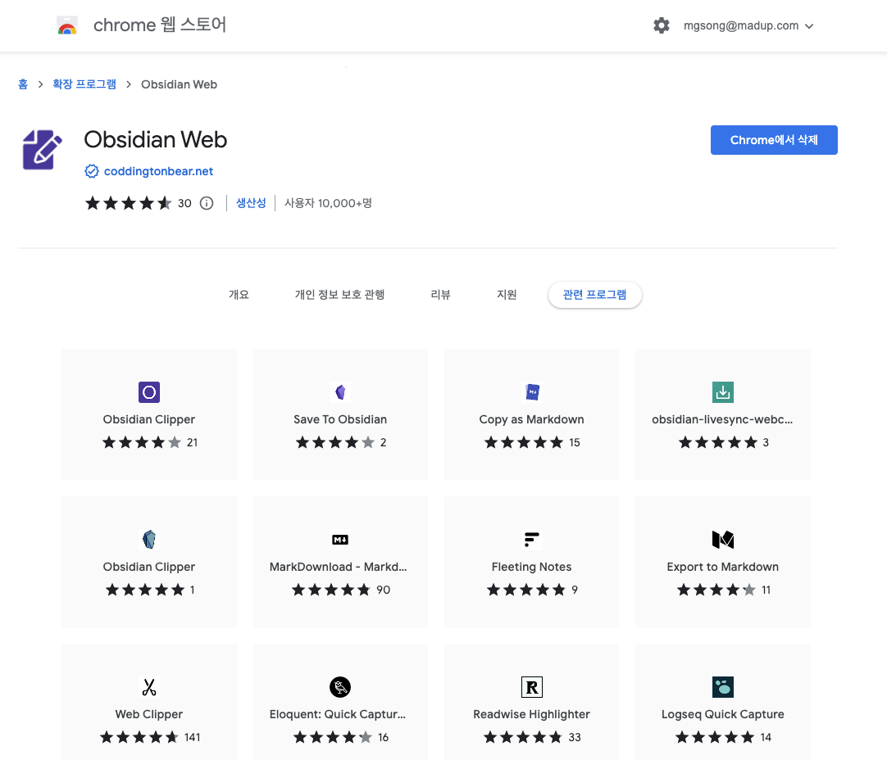
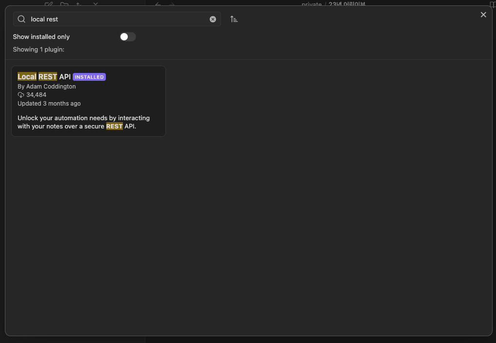
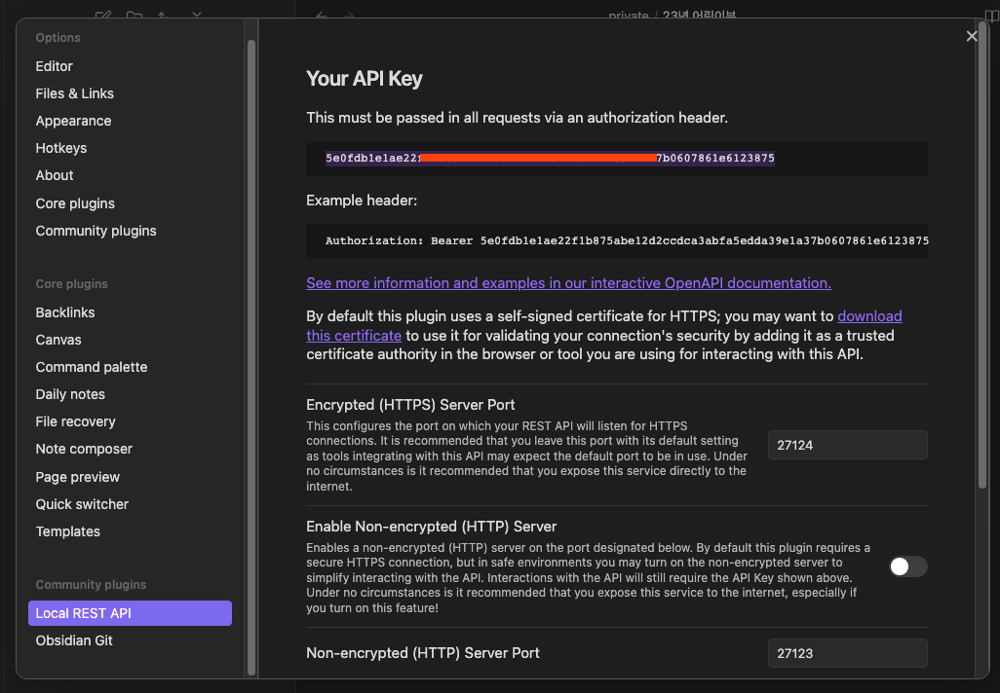
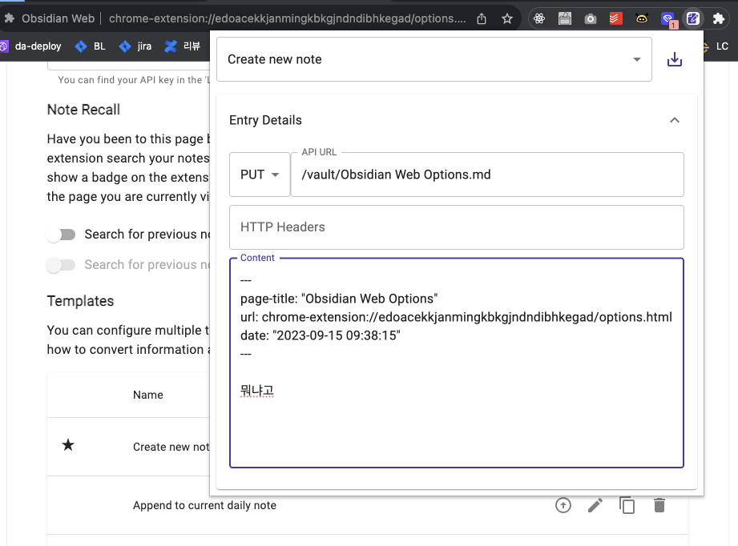

옵시디안은 로컬 파일시스템을 이용하기 때문에 브라우져 익스텐션을 사용하기 위해서는 별도 설정 과정이 필요합니다.

### 크롬 웹 스토어에서 옵시디언 익스텐션 설치
https://chrome.google.com/webstore/detail/obsidian-web/edoacekkjanmingkbkgjndndibhkegad/related

 

### 옵시디안 community plugins 에서 `Local REST API` 플러그인 설치
 

 

### api key 를 복사하여 크롬 익스텐션에서 설정

 

음 근데 이거 뭐 별거 없다;; 익스텐션 사용은 시간이 조금 더 필요해 보인다.

